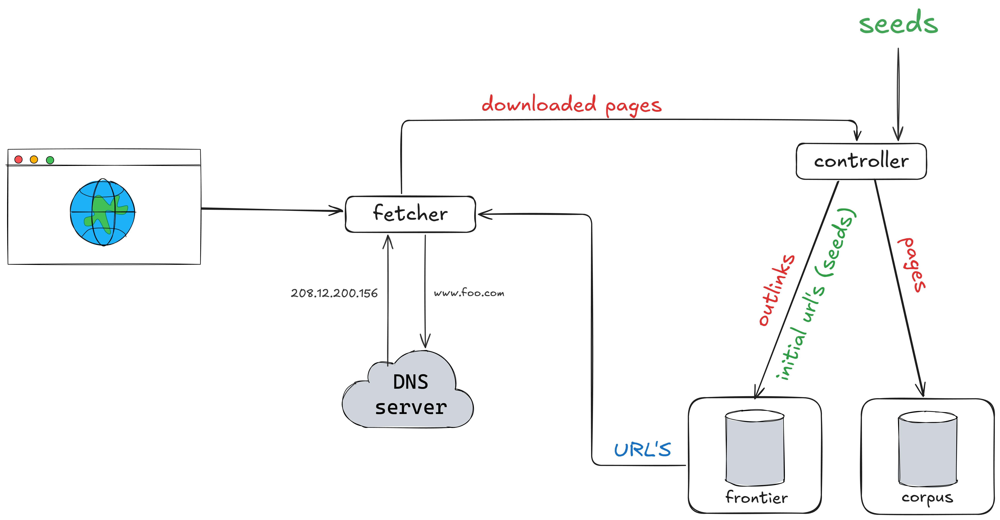

# pa-1-information-retrieval
:information_source: web crawler programming assignment 

    python3 main.py -s <SEEDS> -n <LIMIT> [-d]
    python3 main.py -s seeds.txt -n 1000 -d

    pylint --rcfile=.pylintrc $(git ls-files '*.py')

    procedure crawler(frontier, corpus)
        while not frontier.empty()
            url <- frontier.dequeue()
                if crawlable(url)
                    content <- fetch(url)
                    corpus.store(url, content)
                    for outlink in parse(content)
                        frontier.enqueue(outlink)

## STEPS

- (1): *controller* inicializa a coleta preenchendo a *frontier* com as url's `SEED`
- (2): *frontier* começa a ser consumida pelo *fetcher* que faz download das páginas e devolve as páginas para o *controller*
- (3): *controller* salva as páginas no corpus local (_pages_) e extrai os links (_outlinks_), os _outlinks_ são inseridos na *frontier*
